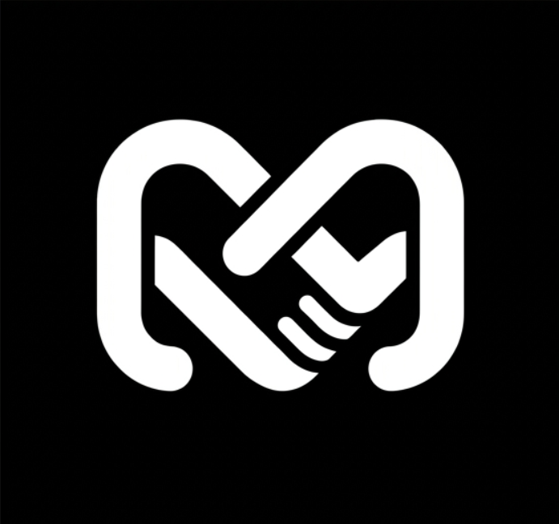

<p align="center">
  
</p>

<h1 align="center">Microjobs.sr</h1>

<p align="center">
  A local-first micro-jobs and talent marketplace for Suriname.
  <br>
  Find work. Find talent. Connect. Get things done.
</p>

<p align="center">
  <a href="https://microjobs-sr.vercel.app/"><strong>Live Application →</strong></a>
</p>

<p align="center">
  
  
  
</p>

<br>

## Tech Stack

<p align="center">
  
</p>

<div align="center">

| Layer          | Technology                                                                                                                                                  |
| -------------- | ----------------------------------------------------------------------------------------------------------------------------------------------------------- |
| Framework      | [Next.js](https://nextjs.org/) (App Router)                                                                                                                 |
| UI             | [React](https://react.dev/), [Tailwind CSS](https://tailwindcss.com/), [Framer Motion](https://www.framer.com/motion/), [Lucide React](https://lucide.dev/) |
| Language       | [TypeScript](https://www.typescriptlang.org/)                                                                                                               |
| ORM            | [Prisma](https://www.prisma.io/)                                                                                                                            |
| Database       | [PostgreSQL](https://www.postgresql.org/) via [Neon](https://neon.tech/)                                                                                    |
| Authentication | Custom session-based authentication with [bcrypt](https://www.npmjs.com/package/bcrypt)                                                                     |
| Hosting        | [Vercel](https://vercel.com/)                                                                                                                               |

</div>

<br>

## What is Microjobs.sr?

Microjobs.sr is a marketplace built around one simple idea: make it easier for people in Suriname to find opportunities, find talent, and connect with each other.

Instead of splitting people into rigid "employer" and "worker" roles, everyone gets one account. From there, users can build a profile, showcase their skills, post jobs, apply to jobs, share projects, and message people directly.

## The Idea

Most job platforms feel huge, corporate, and complicated. Microjobs.sr is intentionally smaller, more local, and more personal.

**Discover → Understand → Connect → Work**

## Built For

* Students
* Freelancers
* Local businesses
* People looking for work
* People looking for talent
* People who simply need something done

One account can participate from either side.

Need something done? Post a job and find people.

Have a skill? Find a job and apply.

<br>

## Core Features

### Profiles

Every user has a profile with a name, bio, location, skills, and projects. It is the starting point for discovering people and understanding what they can actually do.

### Talent Discovery

Browse talent, open a profile, see their skills and projects, and start a conversation. The goal is to make the person behind the skill easy to understand.

### Jobs

Users can create jobs with a title, description, budget, location, and required skills.

Jobs move through a simple lifecycle:

```text
Created → Open → Applications → Accepted or Rejected → Closed
```

### Applications

Applications are tied directly to jobs and can include an optional message.

Duplicate applications for the same job are automatically prevented.

### Projects

Users can showcase projects linked back to their profile.

Skills are useful, but proof is even better.

### Messaging

Conversations happen directly inside Microjobs.

Each conversation is shared between two users rather than split into two separate threads.

The system prevents:

* Self messaging
* Duplicate conversations
* Messaging inactive users

### Dashboard

A single workspace bringing together:

* Profile
* Messages
* Applications
* Jobs
* Projects
* Recent activity

<br>

## Authentication

Microjobs uses custom, session-based authentication.

1. User signs up
2. Password is hashed with bcrypt
3. A secure session token is generated
4. The token is stored in an HTTP-only cookie
5. The user remains authenticated until the session expires or they log out

Inactive accounts are prevented from logging in.

<br>

## Admin System

Microjobs includes a protected admin area, gated by the user's `isAdmin` flag.

```text
User
  ↓
isAdmin: true
  ↓
Admin Dashboard
  ├── Users
  ├── Jobs
  ├── Applications
  └── Projects
```

Admin pages are protected on the server through a `requireAdmin()` check:

1. Is there a current user?

   * If not, redirect to `/login`
2. Is the user an admin?

   * If not, redirect to `/dashboard`
3. If both checks pass:

   * Render the requested admin page

Knowing the `/admin` URL alone is not enough to access the admin system.

### Admin Dashboard

The admin dashboard provides a platform-wide overview including:

* Total and active users
* Total and open jobs
* Total and pending applications
* Total and active projects

Admins can manage users and jobs and view applications and projects, with pending items highlighted for attention.

<br>

## Database

Microjobs uses PostgreSQL through Prisma and Neon.

```text
User ── Jobs ── Applications
User ── Projects
User ── Sessions
User ── Conversations ── Messages
```

The database also stores supporting data such as sessions, error logs, and blacklisted names.

### Rules enforced at the application and database level

* One application per job
* No duplicate conversations
* No self messaging
* Inactive users cannot be contacted
* Inactive accounts cannot log in
* Admin routes require admin access

<br>

## Project Structure

The Next.js application is contained inside the `web/` directory.

```text
microjobs.sr/
│
├── web/
│   ├── src/
│   │   ├── app/
│   │   │   ├── actions/
│   │   │   ├── admin/
│   │   │   │   ├── applications/
│   │   │   │   ├── jobs/
│   │   │   │   ├── projects/
│   │   │   │   ├── users/
│   │   │   │   └── page.tsx
│   │   │   ├── dashboard/
│   │   │   ├── jobs/
│   │   │   ├── listings/
│   │   │   ├── login/
│   │   │   ├── messages/
│   │   │   ├── profile/
│   │   │   ├── projects/
│   │   │   ├── requests/
│   │   │   ├── signup/
│   │   │   └── talent/
│   │   │
│   │   ├── components/
│   │   │   ├── admin/
│   │   │   ├── auth/
│   │   │   ├── dashboard/
│   │   │   ├── jobs/
│   │   │   ├── layout/
│   │   │   ├── messages/
│   │   │   ├── projects/
│   │   │   ├── sections/
│   │   │   ├── talent/
│   │   │   └── ui/
│   │   │
│   │   ├── data/
│   │   ├── generated/
│   │   │   └── prisma/
│   │   ├── hooks/
│   │   ├── i18n/
│   │   └── lib/
│   │
│   ├── prisma/
│   │   ├── schema.prisma
│   │   └── migrations/
│   │
│   ├── public/
│   │   ├── images/
│   │   └── mj-*.png
│   │
│   ├── package.json
│   ├── package-lock.json
│   ├── next.config.mjs
│   ├── postcss.config.mjs
│   ├── prisma.config.ts
│   └── tsconfig.json
│
├── .gitignore
├── README.md
└── ...
```

The project is intentionally modular. Features live in their own areas while sharing the same authentication, database, and UI systems.

<br>

## Getting Started

### 1. Clone the repository

```bash
git clone https://github.com/Nikhcodes/microjobs.sr.git
cd microjobs.sr/web
```

### 2. Install dependencies

```bash
npm install
```

### 3. Configure environment variables

Create a `.env` file inside `web/`:

```text
web/.env
```

Configure the PostgreSQL connection:

```env
DATABASE_URL="your-neon-database-url"
DIRECT_URL="your-neon-direct-database-url"
```

> Never commit `.env` or other files containing real credentials.

### 4. Generate the Prisma client

```bash
npx prisma generate
```

### 5. Apply database migrations

For an existing database:

```bash
npx prisma migrate deploy
```

For local development when creating new migrations:

```bash
npx prisma migrate dev --name your-migration
```

### 6. Start the development server

```bash
npm run dev
```

Then open:

```text
http://localhost:3000
```

<br>

## Database Commands

All Prisma commands should be run from the `web/` directory.

```bash
# Generate Prisma client
npx prisma generate

# Create a development migration
npx prisma migrate dev --name your-migration

# Apply existing migrations
npx prisma migrate deploy

# Inspect the database
npx prisma studio
```

<br>

## Build

From the `web/` directory:

```bash
npm run build
```

The current production build compiles successfully, including all server-rendered routes.

The application currently contains the following main routes:

```text
/
├── /admin
├── /admin/applications
├── /admin/jobs
├── /admin/projects
├── /admin/users
├── /dashboard
├── /jobs
├── /jobs/[jobId]
├── /jobs/create
├── /listings
├── /login
├── /messages
├── /messages/[conversationId]
├── /profile
├── /profile/edit
├── /projects
├── /projects/[projectId]
├── /projects/create
├── /requests
├── /signup
├── /talent
└── /talent/[id]
```

<br>

## Deployment

Microjobs.sr is deployed through Vercel.

The production application is located inside the `web/` directory, so the Vercel project should use:

```text
Root Directory: web
```

The deployment flow is:

```text
GitHub
   ↓
Vercel
   ↓
web/
   ↓
Next.js
   ↓
Prisma
   ↓
Neon PostgreSQL
```

### Production

https://microjobs-sr.vercel.app/

<br>

## Repositories

The project is maintained across two repositories for different purposes.

| Repository                     | Purpose                                            |
| ------------------------------ | -------------------------------------------------- |
| `dwanndanoe-create/thestooges` | Course and teacher-facing repository               |
| `Nikhcodes/microjobs.sr`       | Personal repository used for production deployment |

The course repository is the repository used for submission and review.

The personal repository is used as the production/deployment source.

<br>

## Current Status

The core marketplace is fully working, covering:

* Sign up and login
* User profiles
* Talent discovery
* Jobs
* Job applications
* Projects
* Messaging
* Dashboard
* Admin system
* Prisma migrations
* PostgreSQL database
* Neon production database

The project has moved past "does it work?" and into refinement.

The main systems are connected, and the focus is now on improving interactions, feedback, mobile behavior, and overall usability.

### Up Next

* Unread message counts
* Message read states
* Notifications
* Dashboard activity improvements
* Better talent and job search with filters
* Mobile polish
* Error monitoring
* Additional admin actions

Not feature bloat — just improving the existing experience.

<br>

## Design Philosophy

* People first
* Clarity over complexity
* Connection over bureaucracy
* Local over corporate
* Useful over noisy
* Simple over bloated

Microjobs should make three things obvious:

**Who can help me?**

**What can I do?**

**How do I connect?**

If those answers are easy to find, the platform is doing its job.

<br>

## Why Suriname?

Because local opportunities matter.

Not every job needs to become a global marketplace listing, and not every freelancer needs to compete with thousands of people around the world.

Sometimes the person you need is in your city, your neighborhood, or your network.

And sometimes they just need someone to give them a chance.

Microjobs.sr is built around that idea.

## The Bigger Idea

A job doesn't always need a company.

A worker doesn't always need a resume.

A skill doesn't always need a degree.

Sometimes someone just needs help, and someone else knows how to do it.

Microjobs.sr exists to make that connection easier.

Not LinkedIn.

Not Upwork.

Not another giant global job board.

Something smaller.

Something local.

Something human.

<br>

<p align="center">
  <strong>Built for Suriname, built with intention.</strong>
  <br><br>
  <a href="https://microjobs-sr.vercel.app/"><strong>Visit Microjobs.sr →</strong></a>
  <br><br>
  <sub>Made with Next.js, Prisma, PostgreSQL, Neon, and a questionable amount of coffee.</sub>
</p>
